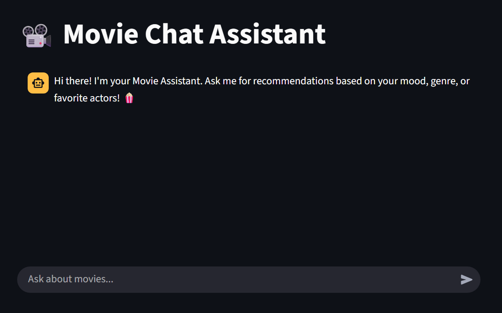
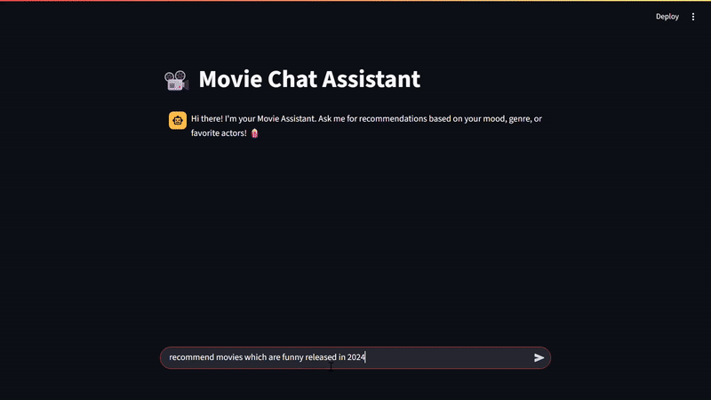
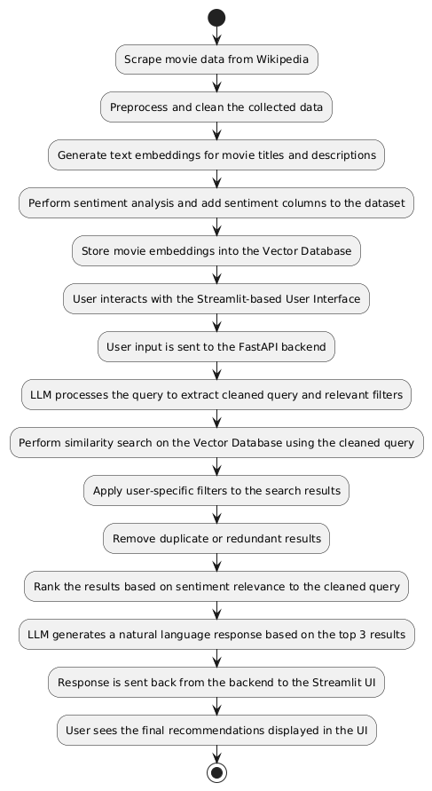

# Movie Recommender Chatbot

An interactive movie recommendation system powered by FastAPI, ChromaDB, and Streamlit. Get movie suggestions based on your mood, favorite actors, genres, directors and even sentiment analysis used to rank on similarity

---

## UI

##  Demo

---
## Implementation
###  [Project Demo Video 1](https://youtu.be/I1UxaiSmH0s)
###  [Project Demo Video 2](https://youtu.be/A75R3UvDcn8)
###  [Project Demo Video 2](https://youtu.be/727_2pb77q4)

---
## Flowchart

---
##  Features

- Custom Dataset built by scraping [Wikipedia](https://www.wikipedia.org/)
- Natural language movie recommendations  
- Sentiment-aware suggestions based on your preferences  
- FastAPI backend with LLM-assisted query processing  
- Vector similarity search using ChromaDB  
- Clean, responsive Streamlit UI  

---

##  Tech Stack

- **Python**, **FastAPI**, **Streamlit** ,**BeautifulSoup** 
- **ChromaDB** for vector search  
- **LLM-based query cleaning and filter extraction**  
- Basic sentiment analysis integration  

---

##  How to Run

1. **Clone the repository**
   `git clone <repo_link>`

2. **Install dependencies**
   Navigate to the project directory and run:
   `pip install -r requirements.txt`

3. **Set up Auth Tokens**
   Generate any required API/Auth tokens and replace them in the respective configuration files.

4. **Build the Vector Database**
   Run the script to build the vector database and store it in your drive or desired location.

5. **Start the FastAPI Backend**
   From the backend directory, run:
   `uvicorn main:app --reload`

6. **Launch the Streamlit Frontend**
   In a separate terminal, run:
   `streamlit run main.py`

---

