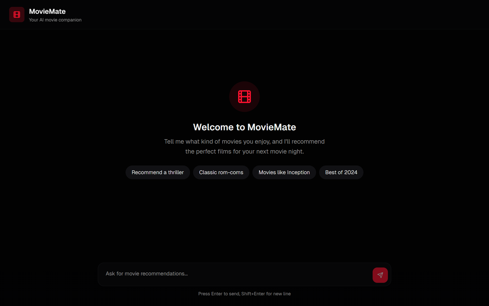
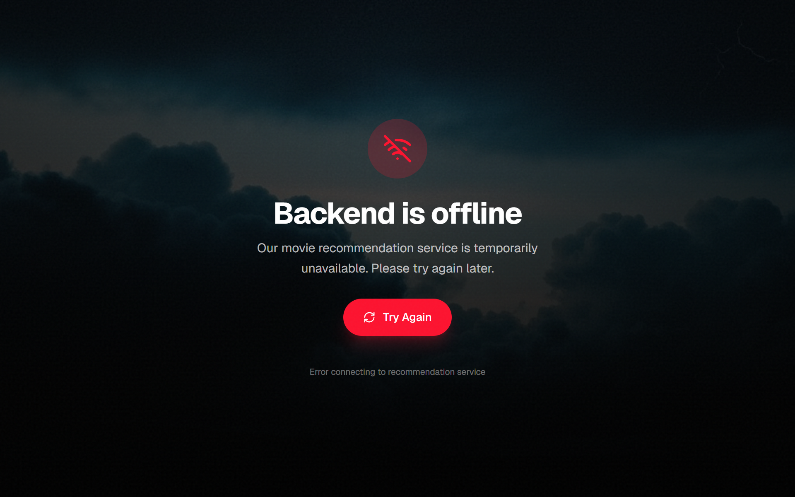

# 🎬 MovieMate — Movie Recommender Chatbot

An end-to-end movie recommendation system powered by a custom web-scraped dataset, hybrid retrieval (vector search + metadata filtering), emotion-based reranking, and a 14B parameter LLM for conversational recommendations with token streaming.

---

## UI HOME PAGE



---

## UI SERVER ERROR PAGE



---

## Implementation

### [Project Demo Video 1]()
### [Project Demo Video 2]()
### [Project Demo Video 3]()

---

## Architecture


---

## Pipeline

```
User Query
    ↓
LLM Query Rewriting          (Qwen2.5-14B → structured embedding format)
    ↓
Metadata Extraction          (actor / director / title / year via regex)
    ↓
Hybrid Retrieval             (pgvector similarity + SQL metadata filters)
    ↓
Emotion Reranking            (RoBERTa-based emotion similarity scoring)
    ↓
Streaming Generation         (Qwen2.5-14B via TextIteratorStreamer → SSE)
    ↓
Next.js Frontend             (token-by-token streaming UI)
```

---

## Features

- **Custom Dataset** — scraped from [Wikipedia](https://www.wikipedia.org/) using BeautifulSoup and Requests; includes titles, descriptions, cast, directors, release dates, and sentiment annotations
- **LLM Query Rewriting** — transforms freeform user queries into structured embedding-aligned format before retrieval
- **Hybrid Retrieval** — pgvector cosine similarity combined with SQL metadata filters (actor, director, title, year) via Supabase RPC
- **Emotion-Based Reranking** — RoBERTa model scores emotional similarity between query and retrieved movies, reranks candidates before generation
- **Token Streaming** — Qwen2.5-14B generates responses token-by-token via `TextIteratorStreamer`, streamed to the frontend as Server-Sent Events
- **Guardrail** — off-topic queries detected and rejected before hitting the retrieval pipeline
- **Responsive UI** — Next.js + Tailwind frontend with markdown rendering and streaming chat interface

---

## Tech Stack

| Layer | Technology |
|---|---|
| **Frontend** | Next.js, Tailwind CSS, Vercel |
| **Backend** | FastAPI, Python, ngrok |
| **LLM** | Qwen2.5-14B-Instruct (4-bit via Unsloth) |
| **Embeddings** | nomic-ai/nomic-embed-text-v1.5 |
| **Emotion Model** | samlowe/roberta-base-go_emotions |
| **Vector DB** | pgvector on Supabase |
| **Prompt Orchestration** | LangChain |
| **Data Collection** | BeautifulSoup, Requests, Wikipedia |
| **Inference Runtime** | Kaggle (dual T4 GPU) |

---

## Deployment Stack

```
Frontend    →  Vercel (Next.js)
Backend     →  Kaggle Notebooks (FastAPI + Uvicorn)
Tunnel      →  ngrok static domain
Vector DB   →  Supabase (pgvector)
```

---

## Database Indexes

The `movies` table (30,000+ rows) uses a combination of HNSW vector indexing and GIN trigram indexes to ensure fast hybrid retrieval across both the embedding similarity search and all metadata filters.

| Index Name | Column | Type | Purpose |
|---|---|---|---|
| `movies_pkey` | `id` | B-tree (unique) | Primary key lookup |
| `movies_embedding_idx` | `embedding` | HNSW (`vector_cosine_ops`) | Fast approximate nearest-neighbour cosine search via pgvector |
| `idx_movies_title` | `title` | GIN (`gin_trgm_ops`) | Fast `ILIKE '%...%'` title substring matching |
| `idx_movies_starring` | `starring` | GIN (`gin_trgm_ops`) | Fast `ILIKE '%...%'` actor/cast substring matching |
| `idx_movies_director` | `directed_by` | GIN (`gin_trgm_ops`) | Fast `ILIKE '%...%'` director substring matching |
| `idx_movies_language` | `language` | GIN (`gin_trgm_ops`) | Fast `ILIKE '%...%'` language substring matching |

**Why HNSW?** The `embedding` column uses an HNSW (Hierarchical Navigable Small World) index with cosine distance ops. At 30k+ rows this avoids a full sequential scan on every query — pgvector can resolve approximate nearest neighbours in sub-millisecond time.

**Why GIN + trigrams?** The `pg_trgm` extension decomposes text into trigrams and stores them in a GIN index, which makes `ILIKE '%substring%'` queries index-accelerated instead of requiring a full table scan. Without this, filtering by actor or director across 30k rows would be slow.

All indexes are defined in `backend/supabase_setup.sql` and are applied automatically during setup (see [Setup](#setup)).

---

## How It Works

### 1. Data Collection
Movies were scraped from Wikipedia using BeautifulSoup and Requests — one of the more involved parts of the project. Each entry includes title, description, cast, director, country, language, release date, and sentiment annotations generated via a RoBERTa emotion classifier.

### 2. Query Rewriting
Before embedding, the user query is rewritten by Qwen2.5-14B into a structured format matching how movies were embedded during ingestion:
```
"movies with the rock" → "Starring: Dwayne Johnson"
"sad romantic films"   → "Description: romance | Emotion: sadness"
```
This aligns the query and document embedding spaces for better retrieval.

### 3. Hybrid Retrieval
Metadata fields (actor, director, title, year) are extracted from the rewritten query and passed as SQL filters to Supabase. Vector similarity reranks within the filtered candidate pool — exact matches handled by SQL (accelerated by GIN trigram indexes), semantic similarity handled by pgvector (accelerated by the HNSW index).

### 4. Emotion Reranking
Retrieved candidates are reranked by cosine similarity between the query's emotion vector and each movie's precomputed emotion vector (28-dimensional RoBERTa output).

### 5. Streaming Generation
The top 5 reranked movies are passed as context to Qwen2.5-14B, which generates a conversational recommendation streamed token-by-token to the frontend via SSE.

---

## Setup

### Prerequisites
- Kaggle account with GPU quota (dual T4)
- Supabase project with pgvector enabled
- ngrok account with a static domain
- Vercel account

### 1. Clone the repository
```bash
git clone <repo_link>
cd movie-recommender
```

### 2. Supabase Setup

All SQL (extensions, indexes, and the `match_movies` RPC function) lives in a single file:

```
backend/
└── supabase_setup.sql   ← run this in the Supabase SQL editor
```

Open your Supabase project → **SQL Editor** → paste and run `backend/supabase_setup.sql`. It will:

1. Enable required extensions (`pgvector`, `pg_trgm`)
2. Create the `movies` table
3. Create all six indexes (HNSW + GIN trigram)
4. Register the `match_movies` RPC function

Then upload your dataset embeddings to the `movies` table.

> **Tip — adding just the function to an existing project:** If your table already exists, you can run only the `CREATE OR REPLACE FUNCTION match_movies(...)` block from the SQL editor without re-running the rest of the file.

### 3. Kaggle Secrets
Add the following secrets in your Kaggle notebook settings:
```
SUPABASE_URL
SUPABASE_KEY
NGROK_TOKEN
HF_TOKEN
```

### 4. Run the Inference Server
Open `backend/response-pipeline.ipynb` in Kaggle, attach GPU accelerator (2x T4), and run all cells. The ngrok URL will be printed in the output.

### 5. Frontend Setup
Set the backend URL in your Vercel project environment variables:
```
NEXT_PUBLIC_API_URL=https://your-ngrok-domain.ngrok-free.app
```
Deploy the `frontend/` directory to Vercel.

---

## Repository Structure

```
movie-recommender/
├── frontend/                  # Next.js + Tailwind app (deploy to Vercel)
├── backend/
│   ├── response-pipeline.ipynb   # Kaggle inference notebook (FastAPI + Qwen2.5-14B)
│   └── supabase_setup.sql        # All DB setup: extensions, table, indexes, RPC function
└── assets/
```

### How to add `supabase_setup.sql` to GitHub

If you haven't committed the file yet:

```bash
# From the repo root
mkdir -p backend
# paste or save the SQL above into the file
nano backend/supabase_setup.sql

git add backend/supabase_setup.sql
git commit -m "feat: add Supabase schema, indexes, and match_movies RPC"
git push
```

Anyone who clones the repo then just needs to paste the file into the **Supabase SQL Editor** and run it — no separate migration tool required.

> **Optional — use Supabase migrations for versioned schema management:**
> ```bash
> npx supabase init                          # creates supabase/ folder
> npx supabase migration new initial_schema  # creates a timestamped .sql file
> # paste supabase_setup.sql content into the generated file
> git add supabase/migrations/
> git commit -m "feat: add initial Supabase migration"
> ```
> This lets you track schema changes over time with `supabase db push`.

---

## Limitations

- Single-user inference (one generation at a time on Kaggle GPU)
- Backend requires manual Kaggle session start
- Dataset coverage limited to movies available on Wikipedia at scrape time

---

## Acknowledgements

- [Unsloth](https://github.com/unslothai/unsloth) for efficient 4-bit inference
- [nomic-ai](https://huggingface.co/nomic-ai/nomic-embed-text-v1.5) for the embedding model
- [Supabase](https://supabase.com) for pgvector hosting
